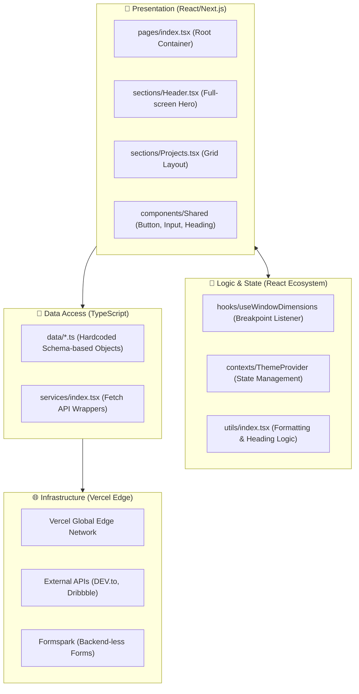
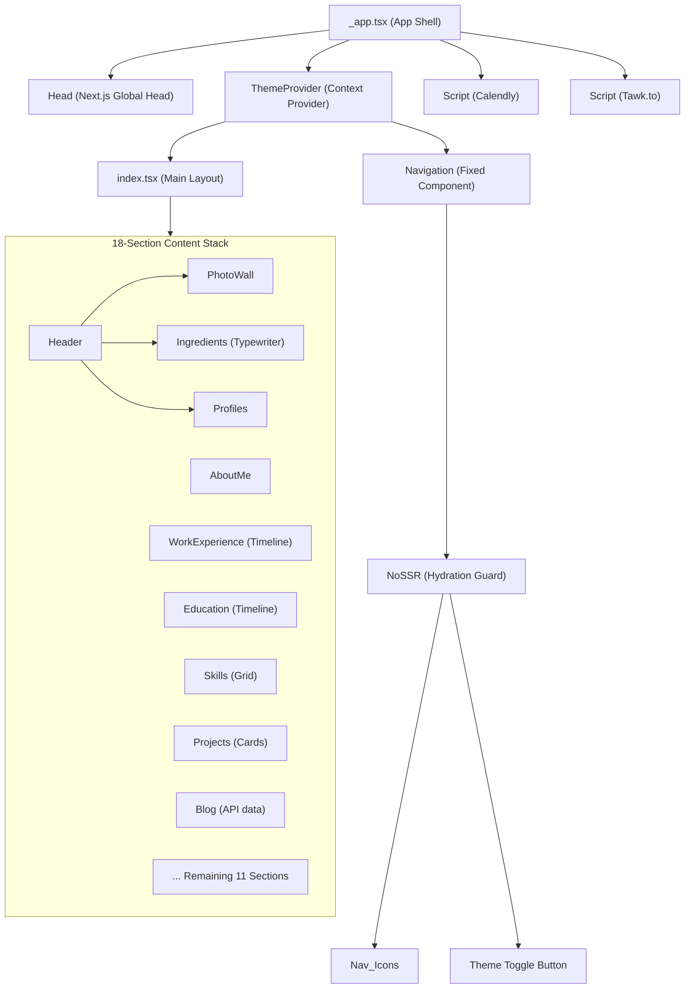
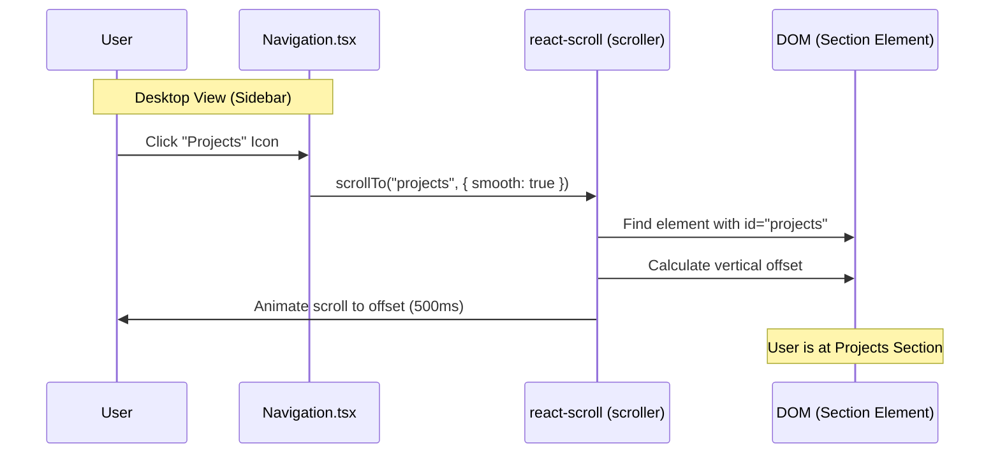
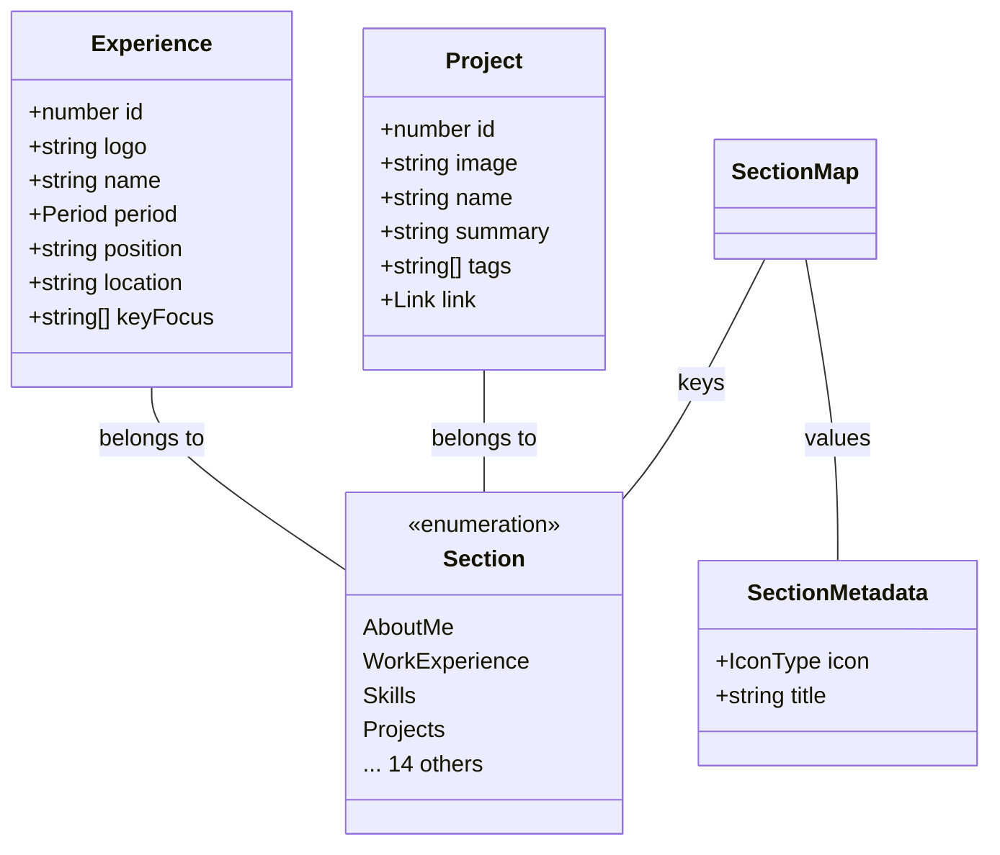
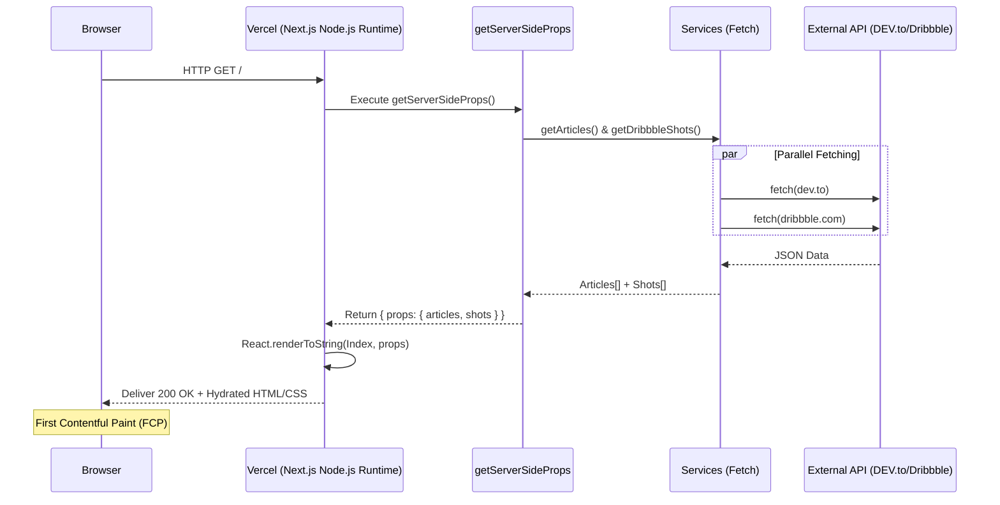
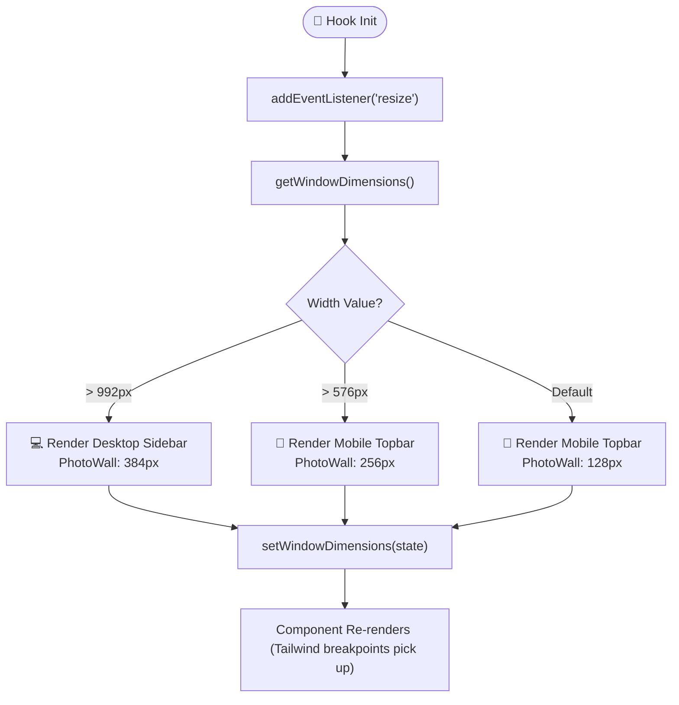
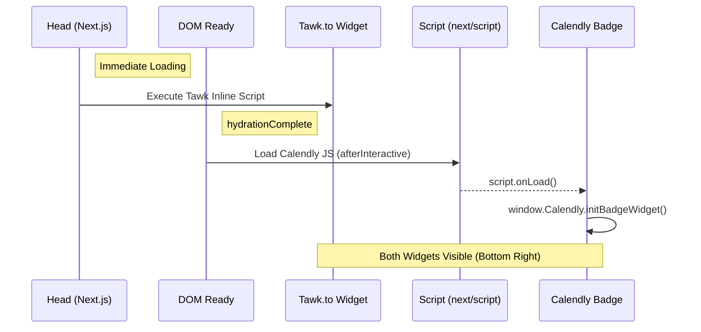
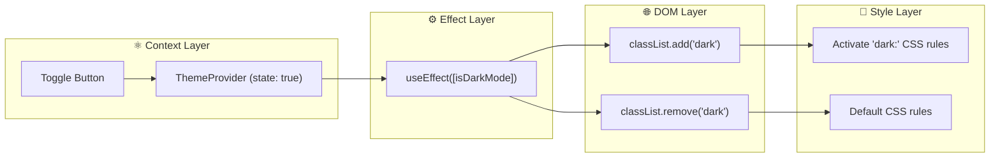
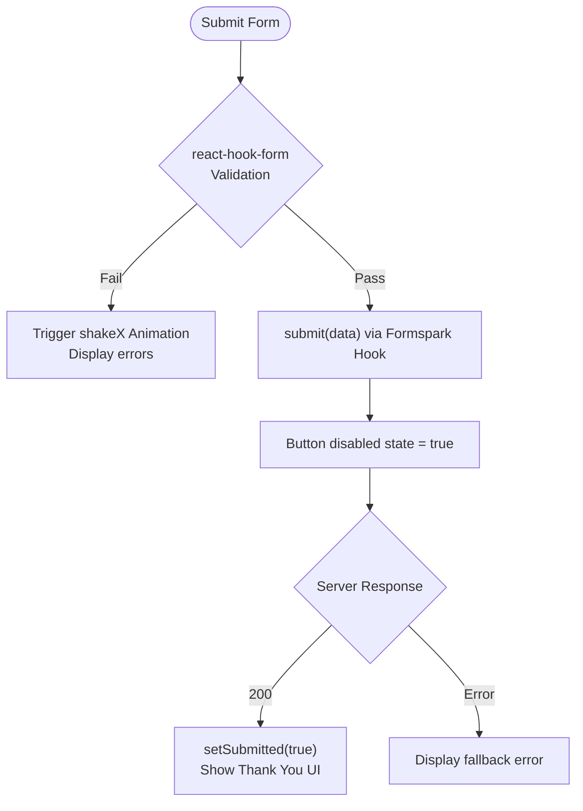
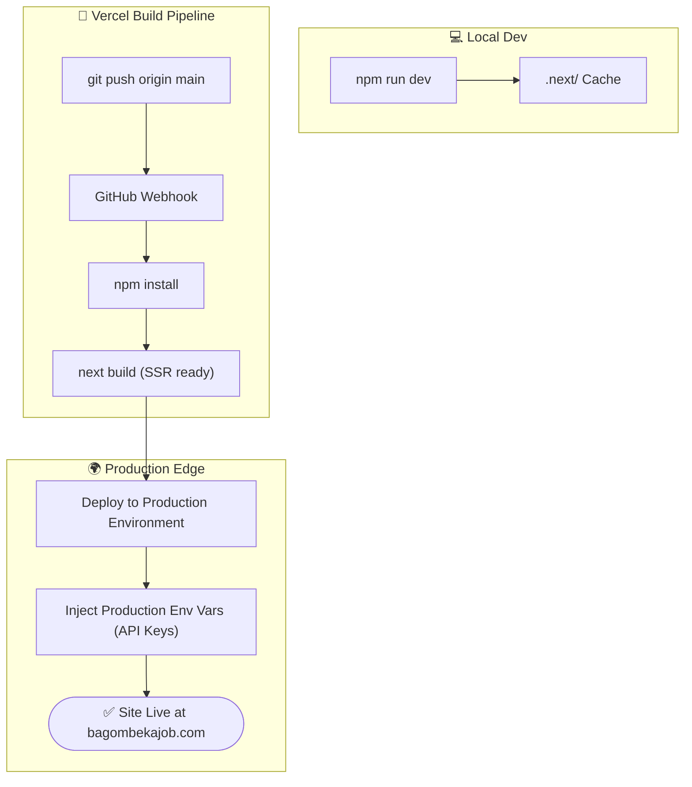

# 🏗️ Hyper-Detailed System Architecture - Bagombeka Job Portfolio

## 1. System Design Philosophy

The portfolio is architected as a **Next.js 13 Single-Page Application (SPA)** utilizing **Server-Side Rendering (SSR)**.

### 1.1 Performance & SEO Strategy
*   **Initial Hydration**: The server delivers a fully populated HTML document, including dynamic data from DEV.to and Dribbble. This eliminates "loading flickers" for the main content.
*   **Atomic Design System**: The `components/` directory follows an atomic-inspired structure where primitives (`Button`, `Input`) are reused across all 18 content `sections/`.
*   **Font & Asset Optimization**: Google Fonts are loaded via `@font-face` equivalents in CSS, and images are managed by `next/image` for WebP serving and lazy loading.

---

## 2. Layered Architecture (Technical Depth)

The system is partitioned into strictly defined layers to ensure maintainability.

---

## 3. Component Hierarchy Tree

A visualization of the React mount lifecycle and component nesting depth.

---

## 4. Navigation & Smooth Scroll Architecture

The site uses `react-scroll` to manage navigation across the single-page layout.

### 4.1 Scroll Mechanism
*   **Fixed Sidebar**: On desktop, the `Navigation` component is `fixed inset-y-0`.
*   **Scroll Intercept**: Clicking a nav item triggers `scroller.scrollTo(sectionId, { duration: 500, smooth: true })`.
*   **Hydration Warning**: Wrapped in `NoSSR` to ensure the sidebar only renders when the `window` object is available for dimension calculations.

### 4.2 User Interaction Sequence

---

## 5. Data Architecture (TypeScript Data Layer)

The project utilizes a strictly typed, file-based data layer. This replaces a database or CMS.

### 5.1 Type Hierarchy & Relationships

---

## 6. SSR Request/Response Pipeline

Detailed flow from the moment the user hits the URL to the full render.

---

## 7. Responsive Layout & Breakpoint Engine

The site uses a custom hook `useWindowDimensions` linked to a `Breakpoints` enum.

### 7.1 Breakpoint Logic Flow

---

## 8. Third-Party Integration Architecture

### 8.1 Initialization Lifecycle
1.  **Tawk.to**: Injected via inline script in `<Head>` within `_app.tsx`. Logic is wrapped in a self-executing function.
2.  **Calendly**: Injected via `<Script strategy="afterInteractive">`. The `onLoad` callback initializes the `initBadgeWidget` with specific hex colors and meeting URLs.
3.  **Formspark**: Managed by the `@formspark/use-formspark` hook within `Contact.tsx`. Handles the POST request to `https://submit-form.com/{formId}`.

### 8.2 Third-Party Loading Order Sequence

---

## 9. Theme Integration Architecture

The site uses standard class-based theming. `isDarkMode` state is synchronized with the `<html>` element's class list via a `useEffect` hook.

---

## 10. Form Validation & Submission Logic

### 10.1 Pipeline
1.  **`react-hook-form`**: Captures input and runs regex validations (email, minLength).
2.  **`animate.css`**: Triggers `shakeX` animation if validation fails.
3.  **`useFormspark`**: Processes the validated payload.

---

## 11. Build & Deployment Lifecycle

The journey from local development to the Vercel Global Edge Network.

---

## 12. Technical Limitation Logic

A record of technical constraints that shape the current architecture.

1.  **Hydration Match**: `NoSSR` is required for components using `window` (Navigation, PhotoWall) to prevent `Text content did not match` errors during initial hydrate.
2.  **API Rate Limits**: DEV.to and Dribbble are fetched server-side; Vercel's caching layer handles high traffic to avoid hitting API limits on every user scroll.
3.  **Bundle Size**: Icons are imported from `@react-icons/all-files` (or pruned by Next.js tree-shaking) to keep the initial JS payload below 150kB.

---

*Hyper-Detailed Documentation | Current as of: March 2026 | Bagombeka Job*
