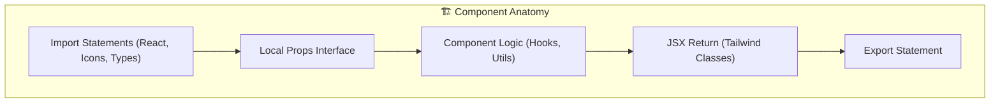
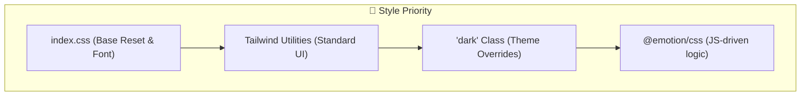
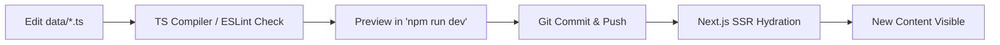
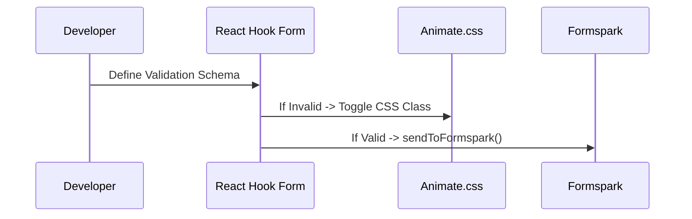
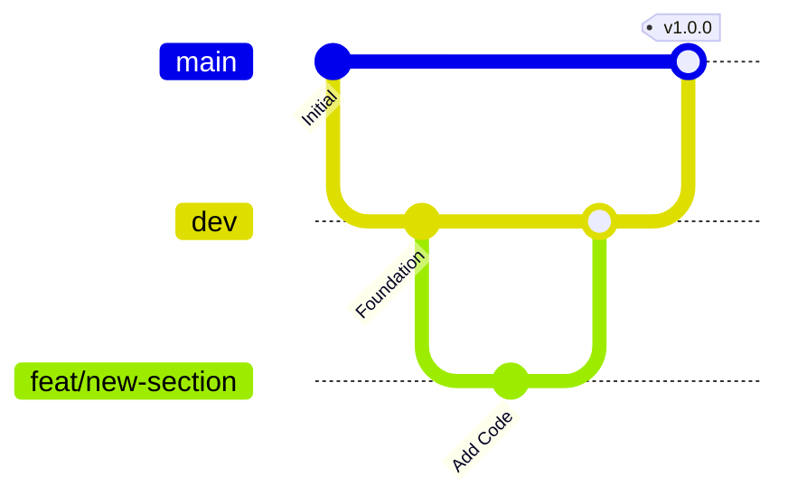

# 🛠️ Developer Guidelines - Bagombeka Job Portfolio

## 1. Introduction & Philosophy

The Bagombeka Job Portfolio is designed to be a high-performance, maintainable, and visually stunning Showcase of professional excellence. These guidelines ensure that any future contributions maintain this standard.

### Core Principles
*   **Performance**: Minimize JS bundle size and optimize all assets.
*   **Type Safety**: Use TypeScript strictly to catch errors at compile time.
*   **Consistency**: Follow the established Atomic design and Tailwind patterns.
*   **Documentation**: Every major architectural change must be reflected in the `/docs` folder.

---

## 2. Coding Standards

### 2.1 TypeScript
*   **Strict Mode**: Always keep `strict: true` in `tsconfig.json`.
*   **Naming**:
    *   `PascalCase` for Components, Interfaces, and Types.
    *   `camelCase` for variables, functions, and file names (except components).
    *   `UPPER_SNAKE_CASE` for constants and environment variables.
*   **Types vs Interfaces**: Prefer `interface` for object shapes and `type` for unions/aliases.

### 2.2 React & Next.js
*   **Function Components**: Use arrow functions for all components.
*   **Hooks**: Keep logic in custom hooks (`hooks/`) if it exceeds 10 lines or is reusable.
*   **Prop Destructuring**: Always destructure props in the function signature.

```tsx
// ✅ Good
interface ButtonProps {
  label: string;
  onClick: () => void;
}

export const CustomButton = ({ label, onClick }: ButtonProps) => {
  return <button onClick={onClick}>{label}</button>;
};
```

---

## 3. Component Architecture Patterns

### 3.1 Directory Structure
*   **`components/Shared`**: Reusable primitives (Buttons, Inputs, Icons).
*   **`sections/`**: High-level block components representing page sections.
*   **`pages/`**: Only contains `index.tsx` (the root container) and `_app.tsx`.

### 3.2 Component Anatomy


---

## 4. Styling Guidelines

### 4.1 Tailwind CSS
*   **Mobile First**: Always start with base classes (mobile) and add `md:`, `lg:` prefixes for larger screens.
*   **Transparency**: Use `bg-opacity-*` or `text-opacity-*` for subtle effects.
*   **Standard Colors**: Reference `tailwind.config.js` for custom brand colors.

### 4.2 Dynamic Styling
*   Use `@emotion/css` **only** when styles depend on real-time JS calculations (e.g., the `PhotoWall` width shifting).
*   For all other cases, use Tailwind utility classes.

### 4.3 Style Hierarchy


---

## 5. Data & Content Management

### 5.1 The `data/` Directory
All structured content is stored in `.ts` files. To update content:
1.  Navigate to `data/`.
2.  Find the relevant file (e.g., `projects.ts`).
3.  Add/Modify the object following the export interface.

### 5.2 Data Update Lifecycle


---

## 6. Adding a New Section

To add a new vertical section to the portfolio:
1.  **Define**: Add the section key to the `Section` enum in `types/Sections.ts`.
2.  **Metadata**: Add an icon and title to `data/sections.ts`.
3.  **Component**: Create `sections/NewSection.tsx`.
4.  **Register**: Import and add the component to the list in `pages/index.tsx`.
5.  **Navigation**: The sidebar will automatically detect and link to it.

---

## 7. Form & Interaction Patterns

### 7.1 Contact Form
*   Use `react-hook-form` for all input handling.
*   **Validation**: Must include required fields, email regex, and character limits.
*   **Animations**: Trigger `animate.css` classes (e.g., `animate__shakeX`) on validation errors.



---

## 8. 3rd Party Integration Rules

*   **Scripts**: Use `next/script` with appropriate strategies (`afterInteractive`, `lazyOnload`).
*   **Widgets**: Initialize in `_app.tsx` or specialized wrapper components.
*   **State**: If a widget has a JS API (like Tawk.to), ensure it doesn't collide with React's DOM management.

---

## 9. Assets & Optimization

### 9.1 Images
*   **Location**: `public/images/`.
*   **Formats**: Prefer `.svg` for icons/illustrations and `.webp` for photos.
*   **Naming**: `kebab-case-names.webp`.

### 9.2 Resume PDF
*   The `resume.pdf` must reside in the root of `public/` for direct linking.

---

## 10. Git & Branching Strategy

Currently, the project follows a simplified **Feature Branch** workflow:



*   **Default Branch**: `dev` (Active development).
*   **Production Branch**: `main` (Stable release).
*   **Commits**: Use conventional commits (e.g., `feat:`, `fix:`, `docs:`, `chore:`).

---

## 11. Testing & Validation

1.  **Linting**: Run `npm run lint` before every commit.
2.  **Type Check**: Run `npx tsc --noEmit` to verify type safety.
3.  **Visual Audit**: Check Light/Dark mode and Mobile/Desktop views manually.

---

*Last updated: March 2026 | Developer Guidelines | Bagombeka Job*
