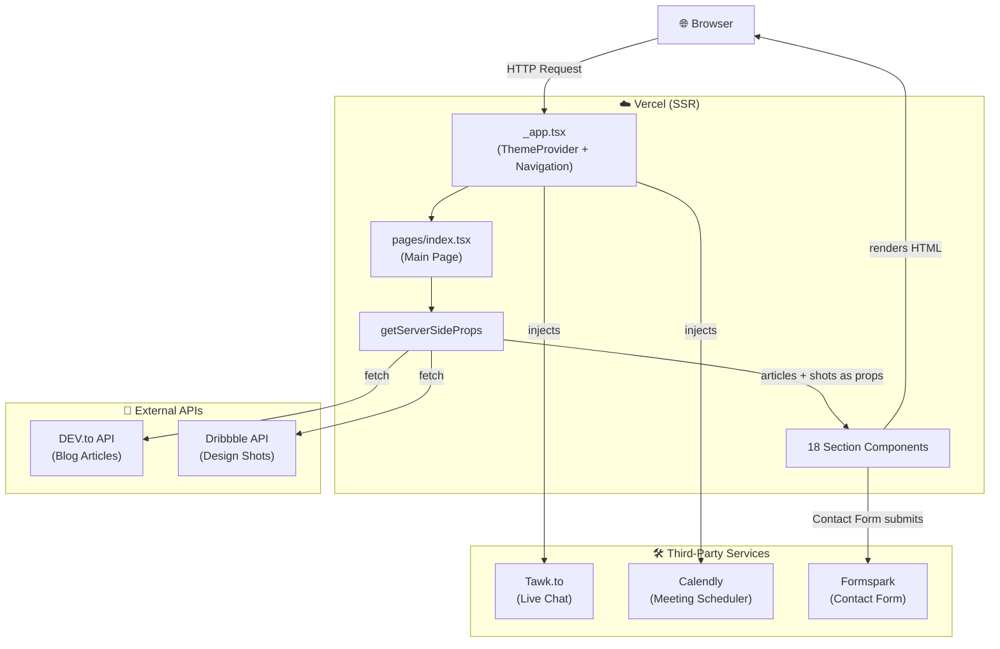
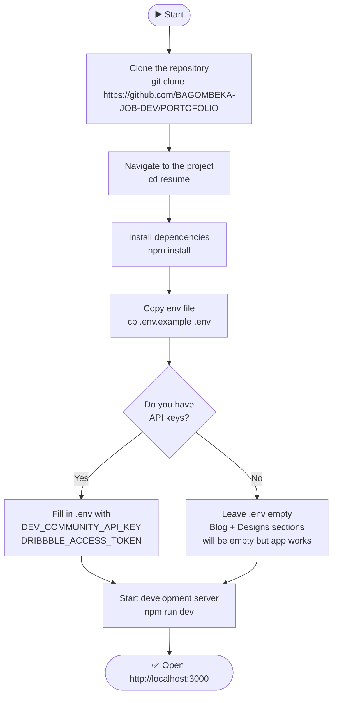
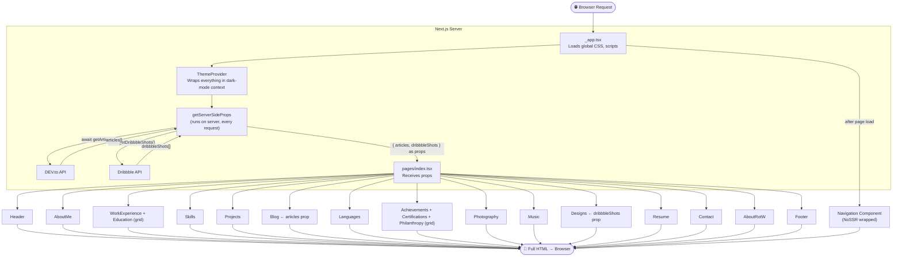
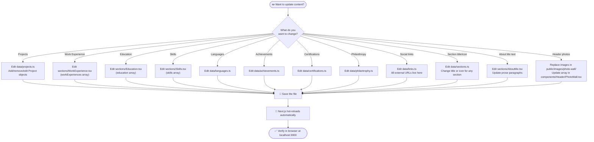
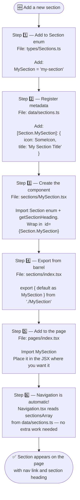
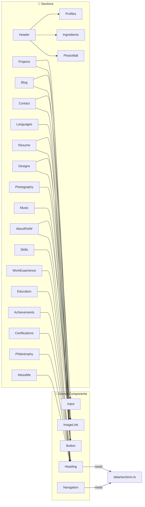
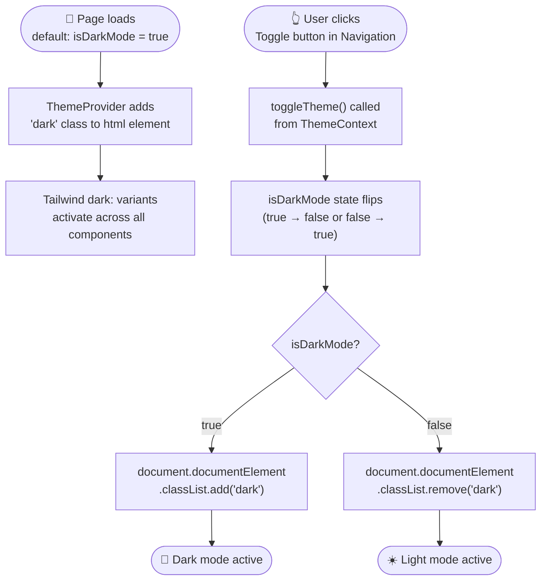
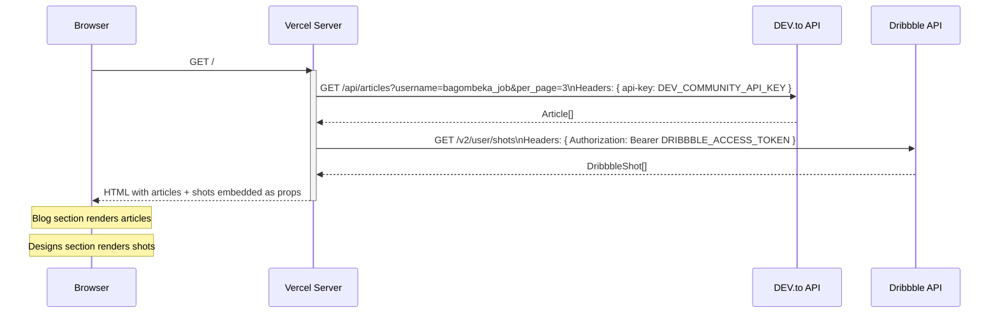
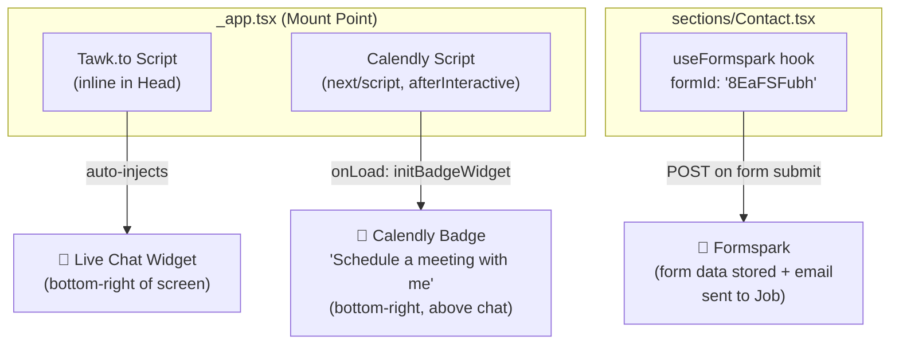
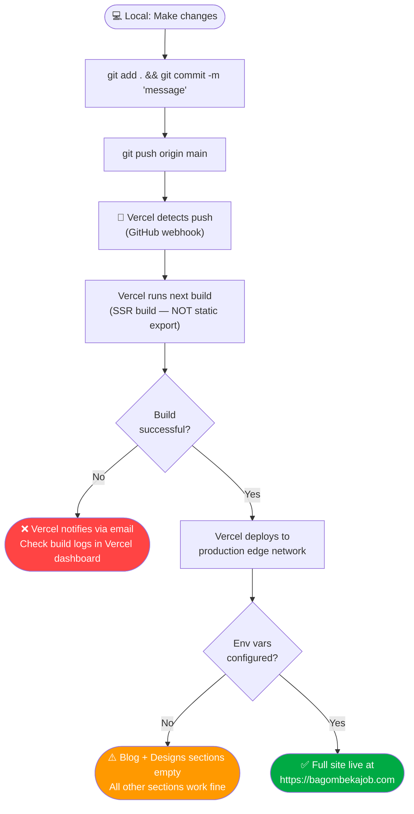

# 🧑‍💻 Bagombeka Job — Portfolio Project Workflow

> **Version:** 2.0.0 | **Framework:** Next.js 13 | **Author:** Bagombeka Job | **Deployed on:** Vercel

This document is the single source of truth for understanding, running, maintaining, and extending this portfolio website. It covers everything from getting started to deploying to production, with diagrams for every major workflow.

---

## Table of Contents

1. [Project Overview](#1-project-overview)
2. [Prerequisites](#2-prerequisites)
3. [Getting Started](#3-getting-started)
4. [Folder Structure](#4-folder-structure)
5. [Page Render Flow](#5-page-render-flow)
6. [Editing Content](#6-editing-content)
7. [Adding a New Section](#7-adding-a-new-section)
8. [Components Guide](#8-components-guide)
9. [Theme System](#9-theme-system)
10. [API Data Flow](#10-api-data-flow)
11. [Third-Party Services](#11-third-party-services)
12. [Images & Assets](#12-images--assets)
13. [Environment Variables](#13-environment-variables)
14. [npm Scripts](#14-npm-scripts)
15. [Deployment Flow](#15-deployment-flow)
16. [Known Issues / TODOs](#16-known-issues--todos)

---

## 1. Project Overview

This is a **single-page personal portfolio website** for Bagombeka Job — a software engineer, designer, and writer based in Kampala, Uganda. The site is designed to tell Job's story through 18 content sections rendered on one scrollable page.

### Tech Stack

| Layer | Technology |
|---|---|
| Framework | Next.js 13 (Pages Router) |
| Language | TypeScript |
| Styling | Tailwind CSS v3 + `@emotion/css` |
| Animation | `animate.css`, `typewriter-effect` |
| Forms | `react-hook-form` + Formspark |
| Tooltips | `@tippyjs/react` |
| Icons | `react-icons` |
| Scroll | `react-scroll` |
| Date Formatting | `date-fns` |
| Deployment | Vercel |

### System Architecture Diagram



---

## 2. Prerequisites

Before working on this project, make sure you have:

| Requirement | Version | Check |
|---|---|---|
| Node.js | v18+ | `node -v` |
| npm | v9+ | `npm -v` |
| Git | Any recent | `git --version` |
| A code editor | VS Code recommended | — |

You will also need API keys for:
- **DEV.to** — to display blog articles
- **Dribbble** — to display design shots

Without these keys the Blog and Designs sections will render empty (graceful fallback, no crash).

---

## 3. Getting Started

### Setup Flowchart



### Commands

```bash
# 1. Clone
git clone https://github.com/BAGOMBEKA-JOB-DEV/PORTOFOLIO
cd resume

# 2. Install dependencies
npm install

# 3. Set up environment variables
cp .env.example .env
# then fill in the values in .env

# 4. Run development server
npm run dev
# → open http://localhost:3000
```

---

## 4. Folder Structure

```
resume/                          ← Project root
├── docs/                        ← 📄 Developer documentation (you are here)
│
├── pages/                       ← Next.js routing (3 files)
│   ├── _app.tsx                 ← App shell: Head, ThemeProvider, Navigation, 3rd-party scripts
│   ├── _document.tsx            ← HTML document customization
│   └── index.tsx                ← Main page: imports + renders all 18 sections
│
├── sections/                    ← 18 content section components
│   ├── Header.tsx               ← Full-screen hero section
│   ├── AboutMe.tsx
│   ├── WorkExperience.tsx       ← Timeline with show-more
│   ├── Education.tsx            ← Timeline with show-more
│   ├── Skills.tsx               ← 12-item skill grid
│   ├── Projects.tsx             ← 6 project cards (from data/projects.ts)
│   ├── Blog.tsx                 ← SSR articles from DEV.to
│   ├── Languages.tsx            ← Typewriter + language list
│   ├── Achievements.tsx
│   ├── Certifications.tsx
│   ├── Philantrophy.tsx
│   ├── Photography.tsx          ← LinkedIn post embeds (iframes)
│   ├── Music.tsx                ← Spotify embed + description
│   ├── Designs.tsx              ← SSR Dribbble shots
│   ├── Resume.tsx               ← PDF download link
│   ├── Contact.tsx              ← react-hook-form + Formspark submission
│   ├── AboutRotW.tsx            ← "About this website" section
│   ├── Footer.tsx
│   └── index.tsx                ← Barrel export for all sections
│
├── components/                  ← Reusable UI primitives
│   ├── Button.tsx
│   ├── Heading.tsx
│   ├── ImageLink.tsx
│   ├── Input.tsx
│   ├── Navigation.tsx           ← Sidebar (desktop) / top-bar (mobile)
│   ├── NoSSR.tsx                ← Prevents SSR for wrapped children
│   └── Header/                  ← Header-specific sub-components
│       ├── PhotoWall.tsx        ← Animated side-by-side photo panels
│       ├── Ingredients.tsx      ← Typewriter code-style intro
│       └── Profiles.tsx         ← Social profile icon buttons
│
├── data/                        ← ✏️ ALL EDITABLE CONTENT LIVES HERE
│   ├── projects.ts
│   ├── languages.ts
│   ├── links.ts                 ← All social/external URLs
│   ├── sections.ts              ← Section metadata (icon + title)
│   ├── achievements.ts
│   ├── certifications.ts
│   └── philantrophy.ts
│
├── types/
│   ├── Sections.ts              ← Section enum + all shared TypeScript types
│   └── Environment.d.ts         ← Env variable type declarations
│
├── contexts/
│   └── ThemeProvider.tsx        ← Dark/light mode context + toggle logic
│
├── hooks/
│   └── useWindowDimensions.tsx  ← Reactive window width/height + breakpoints
│
├── services/
│   └── index.tsx                ← getArticles() + getDribbbleShots() API calls
│
├── utils/
│   └── index.tsx                ← getSectionHeading(), formatDateString(), openURLInNewTab()
│
├── styles/
│   └── globals.css              ← Global CSS
│
├── public/
│   └── images/                  ← All static images
│       ├── logo.png
│       ├── mylogo.png
│       ├── photo-wall/          ← Header photos
│       ├── projects/            ← Project screenshots
│       ├── skills/              ← Skill icons
│       ├── work-experience/     ← Company logos
│       ├── education/           ← School logos
│       ├── about-me/            ← About me illustration
│       └── resume/              ← PDF + cover image
│
├── .env                         ← Local env vars (gitignored)
├── .env.example                 ← Template for env vars
├── next.config.js
├── tailwind.config.js
├── tsconfig.json
└── package.json
```

---

## 5. Page Render Flow

This diagram shows how Next.js assembles the page on every request.



---

## 6. Editing Content

All portfolio content is stored as **plain TypeScript objects** in `data/*.ts` files. No database, no CMS — just edit the file and save.

### Content Edit Flowchart



### Quick Reference: What's in Each Data File

| File | Type exported | Shape |
|---|---|---|
| `data/projects.ts` | `Project[]` | `{ id, image, name, summary, tags, link? }` |
| `data/languages.ts` | `Language[]` | `{ id, language, text, translation? }` |
| `data/links.ts` | `object` | `{ github, linkedin, instagram, dribbble, dev, resume, repository, follow_me_on_linkedin }` |
| `data/sections.ts` | `SectionMap` | `{ [Section]: { icon: IconType, title: string } }` |
| `data/achievements.ts` | `Achievement[]` | `{ id, title, subtitle }` |
| `data/certifications.ts` | `Certification[]` | `{ id, title, subtitle }` |
| `data/philantrophy.ts` | `Philantrophy[]` | `{ id, title, description }` |

---

## 7. Adding a New Section

Follow these steps every time you want to add a brand-new section to the portfolio.

### New Section Flowchart



### Minimal Section Template

```tsx
// sections/MySection.tsx
import { Section } from "types/Sections";
import { getSectionHeading } from "utils";

const MySection: React.FC = () => (
  <div id={Section.MySection}>
    {getSectionHeading(Section.MySection)}

    {/* Your content here */}
  </div>
);

export default MySection;
```

---

## 8. Components Guide

### Component Dependency Diagram

This shows which reusable components each major section uses.



### Component API

#### `<Button>`
```tsx
<Button
  icon={FaGithub}        // optional, defaults to BiLinkExternal
  onClick={() => {}}     // required
  disabled={false}       // optional
  className="mt-8"       // optional
>
  Button Label
</Button>
```

#### `<Input>`
```tsx
<Input
  type="text"            // or "email", "textarea"
  label="Full Name"
  placeholder="Your Name"
  description="Helper text shown below"
  hasError={!!errors.name}
  {...register("name")}  // react-hook-form compatible
/>
```

#### `<Heading>`
```tsx
// Usually not called directly — use the util instead:
getSectionHeading(Section.MySection)

// Which renders internally:
<Heading icon={SomeIcon}>Section Title</Heading>
```

#### `<ImageLink>`
```tsx
<ImageLink
  src="/images/projects/myapp.png"
  alt="My App"
  href="https://example.com"
  dimensions={{ width: 500, height: 250 }}  // optional
  height={250}                               // or just height
/>
```

#### `<NoSSR>`
Wraps any component to **disable server-side rendering** for it. Use for browser-only APIs.
```tsx
<NoSSR>
  <ComponentThatUsesWindow />
</NoSSR>
```

---

## 9. Theme System

The site **defaults to dark mode** and uses a React Context + Tailwind's `dark` class strategy.

### Theme Toggle Flowchart



### How to Use Theme in a Component

```tsx
// Option 1: use Tailwind dark: prefix (preferred)
<div className="bg-white dark:bg-neutral-900 text-black dark:text-white">

// Option 2: read isDarkMode from context
import { useContext } from "react";
import { ThemeContext } from "contexts/ThemeProvider";

const { isDarkMode } = useContext(ThemeContext);
```

---

## 10. API Data Flow

Two live data sources are fetched server-side on every page request.

### Data Flow Diagram



### Error Handling

- If `DEV_COMMUNITY_API_KEY` is missing → `getArticles()` returns `[]`, Blog section renders with 0 cards
- If `DRIBBBLE_ACCESS_TOKEN` is missing or invalid → `getDribbbleShots()` returns `[]`, Designs section renders with 0 shots
- Both are **silent graceful failures** — the page never crashes

---

## 11. Third-Party Services

### Services Map



### Updating Each Service

| Service | Where to change | What to change |
|---|---|---|
| **Tawk.to** | `pages/_app.tsx` line 28 | Replace the embed URL with your Tawk.to widget URL |
| **Calendly** | `pages/_app.tsx` line 51 | Replace the `url` with your Calendly event link |
| **Formspark** | `sections/Contact.tsx` line 25 | Replace `"8EaFSFubh"` with your Formspark form ID |

---

## 12. Images & Assets

All static assets live under `public/images/`. Next.js serves them from the root `/` URL.

### Image Directory Layout

```
public/images/
├── logo.png              ← Large name logo shown in Header
├── mylogo.png            ← Small square logo used in Navigation
├── photo-wall/           ← Header hero photos (add to PhotoWall.tsx array)
│   ├── job1.png
│   └── JOB.jpeg
├── about-me/
│   └── selfie-boy.svg
├── projects/             ← One image per project (referenced in data/projects.ts)
├── skills/               ← One icon per skill category (referenced in Skills.tsx)
├── work-experience/      ← Company logos (referenced in WorkExperience.tsx)
├── education/            ← School logos (referenced in Education.tsx)
└── resume/
    ├── cover.png         ← Resume preview image
    └── job_software_engineer.pdf  ← Downloadable PDF
```

### Rules

- Use **PNG or JPEG** for photos and logos
- Use **SVG** for illustrations and icons when possible
- Always provide `alt` text with `next/image`
- Use the `fill` prop for images inside a `relative` parent, or explicit `width`/`height`
- Images are automatically optimized by Next.js (`sharp` is installed)

---

## 13. Environment Variables

| Variable | Required | Used In | Description |
|---|---|---|---|
| `DEV_COMMUNITY_API_KEY` | Optional | `services/index.tsx` | DEV.to API key to fetch blog articles. Get one at [dev.to/settings/extensions](https://dev.to/settings/extensions) |
| `DRIBBBLE_ACCESS_TOKEN` | Optional | `services/index.tsx` | Dribbble OAuth access token. Create an app at [dribbble.com/account/applications](https://dribbble.com/account/applications) |

### `.env.example`

```env
DEV_COMMUNITY_API_KEY=your_dev_to_api_key_here
DRIBBBLE_ACCESS_TOKEN=your_dribbble_access_token_here
```

> ⚠️ **Never commit your `.env` file.** It is already in `.gitignore`.

---

## 14. npm Scripts

| Script | Command | What it does |
|---|---|---|
| `dev` | `next dev` | Starts local dev server with hot reload at `localhost:3000` |
| `build` | `next build` | Creates an optimized production build |
| `start` | `next start` | Serves the production build locally |
| `export` | `next export` | Exports as static HTML (note: SSR won't work in this mode) |
| `lint` | `eslint --fix .` | Runs ESLint and auto-fixes where possible |
| `format` | `prettier --write .` | Formats all files with Prettier |

---

## 15. Deployment Flow

The project is deployed on **Vercel** with automatic deployments on every `git push`.

### Deployment Flowchart



### Setting Up Vercel

1. Go to [vercel.com](https://vercel.com) and import the GitHub repository
2. Framework preset: **Next.js** (auto-detected)
3. Build command: `npm run build` (auto-detected)
4. Output directory: `.next` (auto-detected)
5. Add environment variables in **Vercel Dashboard → Project → Settings → Environment Variables**:
   - `DEV_COMMUNITY_API_KEY`
   - `DRIBBBLE_ACCESS_TOKEN`

---

## 16. Known Issues / TODOs

| # | Issue | Location | Severity |
|---|---|---|---|
| 1 | Work experience `summary` fields are all **empty strings** — no job descriptions shown on the page | `sections/WorkExperience.tsx` lines 31, 59, 84, 95 | 🟡 Medium |
| 2 | Education data starts at **id: 2** — id: 1 appears to have been removed | `sections/Education.tsx` | 🟢 Low |
| 3 | `PhotoWall` only has **2 photos** in the array | `components/Header/PhotoWall.tsx` | 🟢 Low |
| 4 | `eslint@8.48.0` is **deprecated** — upgrade to ESLint 9 when `eslint-config-next` supports it | `package.json` | 🟡 Medium |
| 5 | `next@13.4.19` has a **security vulnerability** — upgrade to Next.js 14+ | `package.json` | 🔴 High |
| 6 | The `Photography` section title says **"Check out my Linkedin Profile"** but the section key is `photography` — could be renamed | `data/sections.ts` | 🟢 Low |

---

*Last updated: March 2026 — Bagombeka Job*
