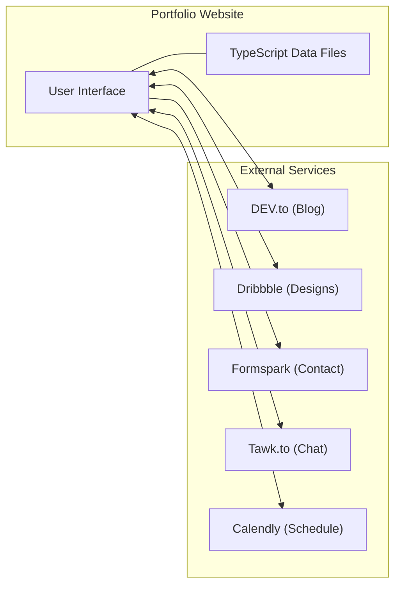
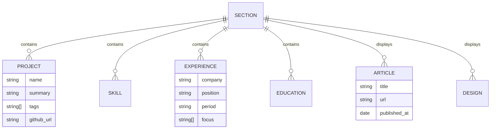
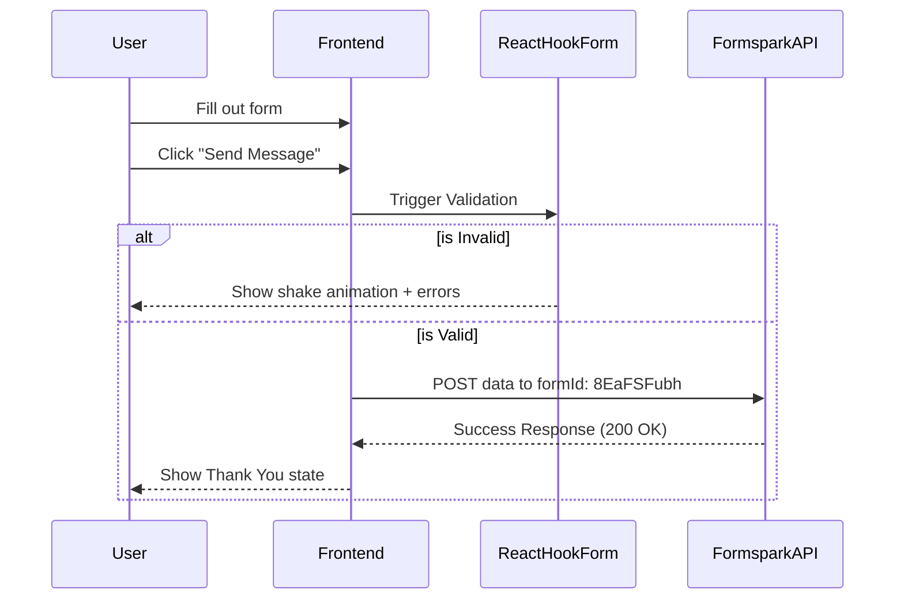

# 📄 Software Requirements Specification (SRS) - Bagombeka Job Portfolio

## 1. Introduction

### 1.1 Purpose
The purpose of this document is to provide a comprehensive description of the software requirements for the Bagombeka Job Portfolio website. It illustrates the functional and non-functional requirements and the external interfaces of the system.

### 1.2 Scope
The system is a single-page, responsive personal portfolio website designed to showcase the professional journey, skills, projects, and personal interests of Bagombeka Job. It integrates with external APIs and services to provide live data and interactive features.

### 1.3 Definitions, Acronyms, and Abbreviations
*   **SRS**: Software Requirements Specification
*   **SSR**: Server-Side Rendering
*   **Next.js**: A React framework for building web applications.
*   **Tailwind CSS**: A utility-first CSS framework.
*   **API**: Application Programming Interface
*   **Vercel**: The deployment platform used for hosting the site.

---

## 2. Overall Description

### 2.1 Product Perspective
The portfolio acts as a digital identity hub. It differentiates itself from a standard static resume by providing real-time integrations (blog, designs) and interactive elements (chat, meeting scheduler).

### 2.2 Product Functions
*   **Information Display**: Presenting bio, work history, education, and skills.
*   **Portfolio Showcase**: Displaying projects and design work.
*   **Content Feed**: Fetching live articles from DEV.to and shots from Dribbble.
*   **Contact & Communication**: Allowing users to send messages, chat live, and schedule meetings.
*   **Theming**: Providing a persistent dark/light mode toggle.

### 2.3 User Classes and Characteristics
*   **The Owner (Job)**: Responsible for content updates via data files and managing external service accounts.
*   **Visitors (HR/Recruiters)**: Seeking professional details, resume downloads, and contact methods.
*   **Peers/Collaborators**: Interested in technical skills and open-source contributions.

### 2.4 Design and Implementation Constraints
*   **Next.js 13**: Must use the Pages Router as currently implemented.
*   **Tailwind CSS**: All styling must follow Tailwind's utility-first approach.
*   **Static Assets**: Images and documents must be hosted locally in `public/`.
*   **No Database**: All structured content must remain in TypeScript data files.

---

## 3. External Interface Requirements

### 3.1 User Interfaces
*   **Responsive Layout**: The UI must adapt to Mobile (<768px), Tablet (768px-992px), and Desktop (>992px).
*   **Navigation**: Icon-based sidebar on desktop, top-bar on mobile.
*   **Visual Feedback**: Buttons and interactive elements must have hover/active states.

### 3.2 Software Interfaces
*   **DEV.to API**: Connection via `API-Key` to fetch articles.
*   **Dribbble API**: Connection via `Oauth Bearer Token` to fetch design shots.
*   **Formspark**: Target for form submissions (formId: `8EaFSFubh`).
*   **Tawk.to**: Inline script for live chat widget.
*   **Calendly**: Script-based meeting scheduler badge.



---

## 4. System Features (Functional Requirements)

### 4.1 Navigation System (FR-1)
*   **ID**: FR-1
*   **Description**: The system shall provide smooth scrolling navigation to all 18 sections.
*   **Priority**: High

### 4.2 Content Sections (FR-2 to FR-19)
*   **FR-2 (Header)**: Display animated photo wall, logo, and typewriter intro.
*   **FR-3 (About Me)**: Display personal bio and illustration.
*   **FR-4 (Work Experience)**: Show interactive timeline of professional history.
*   **FR-5 (Education)**: Show interactive timeline of academic history.
*   **FR-6 (Skills)**: List technical skills with icons.
*   **FR-7 (Projects)**: Showcase specific projects with screenshots and links.
*   **FR-8 (Blog)**: Fetch and display the 3 latest articles from DEV.to.
*   **FR-9 (Languages)**: Cycle through known languages using typewriter effect.
*   **... (through all 18 sections)**

### 4.3 Content Management (FR-20)
*   **ID**: FR-20
*   **Description**: The owner shall be able to update all content by modifying TypeScript arrays/objects in the `data/` directory.

### 4.4 Contact Form (FR-21)
*   **ID**: FR-21
*   **Description**: The system shall validate user input (Full Name, Email, Message) and submit data to Formspark.

---

## 5. Non-Functional Requirements

### 5.1 Performance
*   Page must achieve high LightHouse scores for Performance and Accessibility.
*   Images must be optimized via `next/image`.

### 5.2 Availability
*   The system shall be available 99.9% of the time via the Vercel edge network.

### 5.3 Security
*   API keys must be stored in server-side environment variables and never exposed to the client-side bundle.

### 5.4 Maintainability
*   The codebase shall be clean, type-safe (TypeScript), and followed by documented developer workflows.

---

## 6. Diagrams

### 6.1 Use Case Diagram
```mermaid
useCaseDiagram
    actor "Visitor" as V
    actor "Owner (Job)" as O

    package "Portfolio System" {
        usecase "View Professional Profile" as UC1
        usecase "Download Resume" as UC2
        usecase "Submit Contact Form" as UC3
        usecase "Schedule Meeting" as UC4
        usecase "Live Chat" as UC5
        usecase "Toggle Dark/Light Mode" as UC6
        usecase "Update Content (Code)" as UC7
    }

    V --> UC1
    V --> UC2
    V --> UC3
    V --> UC4
    V --> UC5
    V --> UC6
    O --> UC7
    O --> UC6
```

### 6.2 Data Model (Entity-Relationship)


### 6.3 Theme State Machine
```mermaid
stateDiagram-v2
    [*] --> Dark_Mode: Default State
    Dark_Mode --> Light_Mode: toggleTheme()
    Light_Mode --> Dark_Mode: toggleTheme()

    state Dark_Mode {
        Html_Class: "dark"
    }
    state Light_Mode {
        Html_Class: "none"
    }
```

### 6.4 Contact Form Submission Sequence


---

*Last updated: March 2026*
